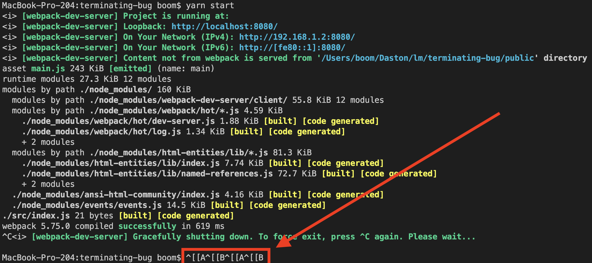
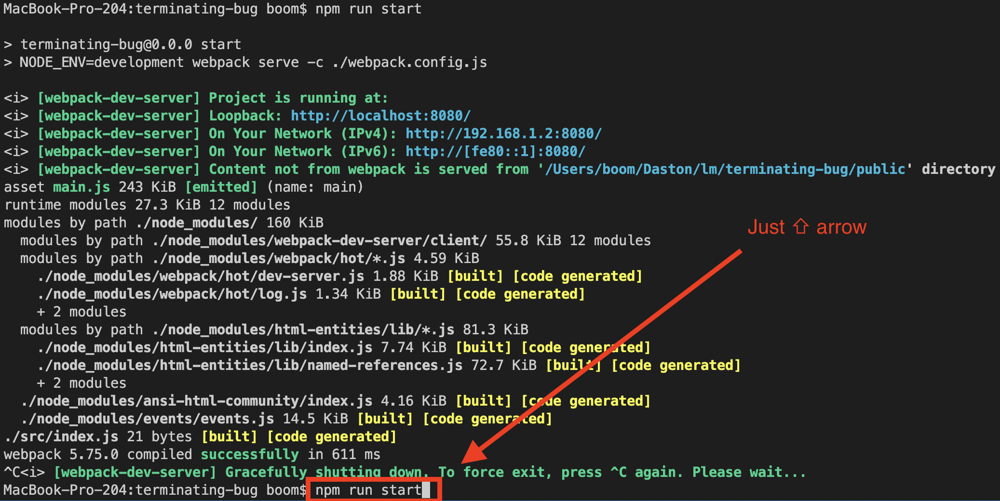

# Process termination bug in Yarn Berry

Steps to reproduce:
- `yarn start`
- Press `Ctrl + C`
- Press some key arrows (`⇦ 	⇧ 	⇨ 	⇩`)
- Look in the console

If u try to reroduce it with `npm` everything will be fine:

Environment:
- MacOS 12.6
- M1 Pro
- `node` 18.4.0
- `yarn` 3.4.1
- `npm` 8.12.1